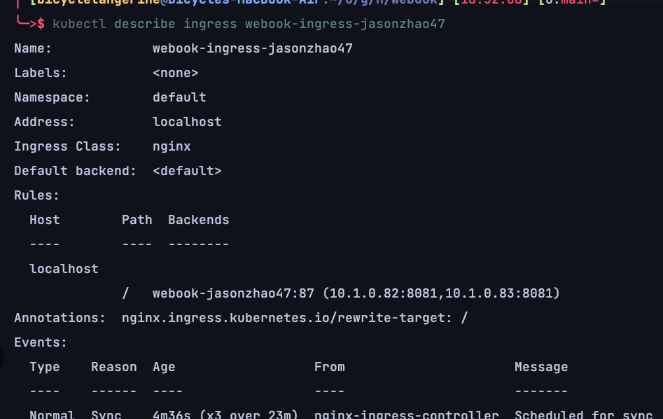
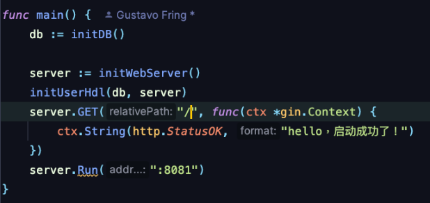
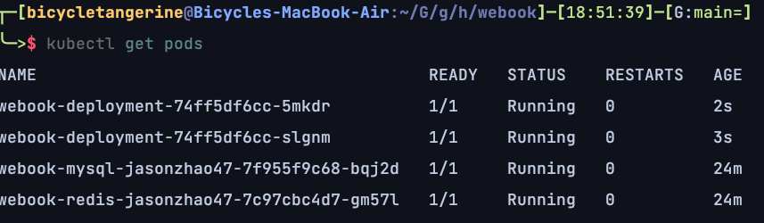
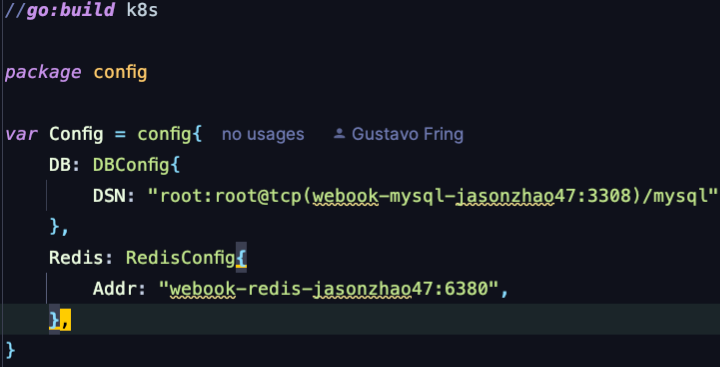
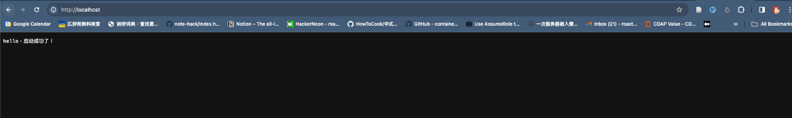

## 作业：修改已有的部署方案
将 webook 的启动端口修改 8081。

将 webook 修改为部署 2 个 Pod。

将 webook 访问 Redis 的端口修改为 6380。
将 webook 访问 MySQL 的端口修改为 3308。

你需要提供：

kubectl get services 的截图。
kubectl get pods 的截图。
你通过浏览器访问 webook，能够正确得到响应的截图。
作业提交
截止时间：2023 年 10 月 22 日（周日）24:00
提交方法：将你作业的 Gitee 或 GitHub 地址填写到下方的“作业提交框”中，并点击提交即可（记得开权限哦，不然助教老师打不开~）
作业批改
截止时间后一周内
关注“极客时间训练营”公众号作业批改完成会有消息提示